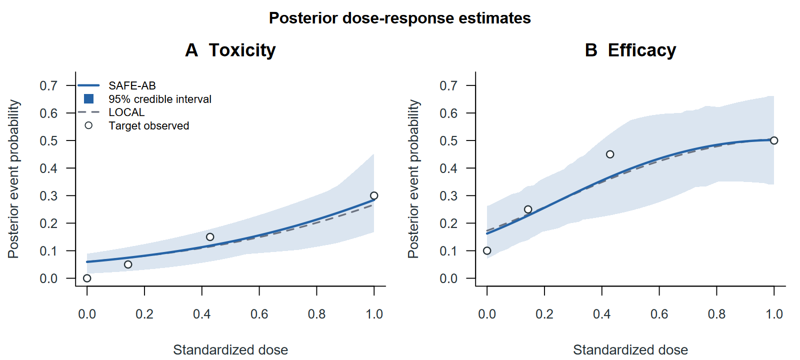
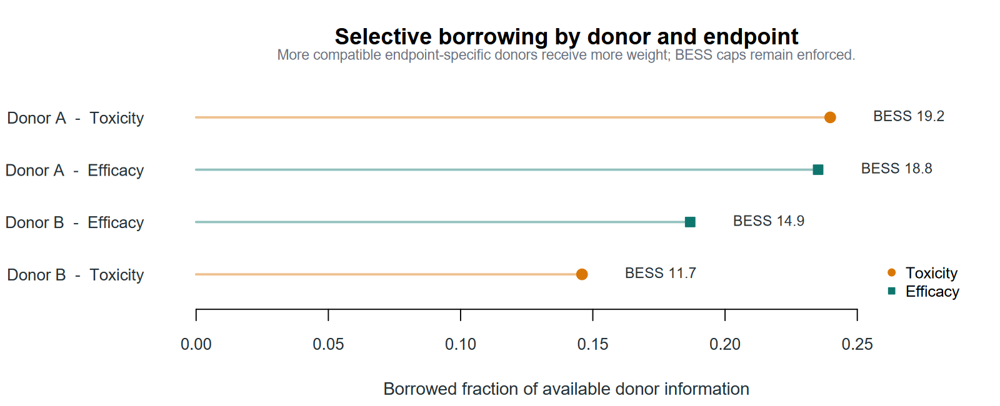
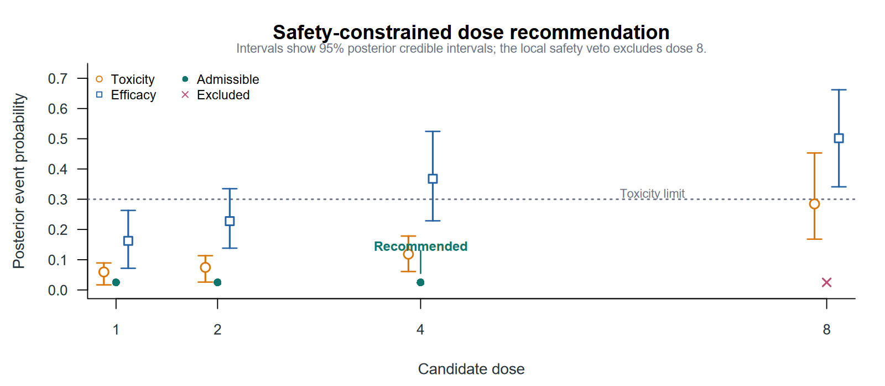

<div align="center">

# safeab

### Safety-aware selective Bayesian borrowing for dose-response studies

[](https://github.com/haohaostats/safeab/releases)
[](https://www.r-project.org/)
[](LICENSE)

</div>

`safeab` fits target-study dose-response models while selectively borrowing
compatible information from one or more external studies. It keeps borrowing
transparent through endpoint- and dose-specific diagnostics, enforces borrowed
effective sample size caps, and supports a target-only local safety veto before
dose recommendation.

<p align="center">
  
</p>

## What safeab provides

- Endpoint-specific, conflict-adaptive borrowing for toxicity and efficacy
- Donor-level and total borrowed effective sample size caps
- LOCAL and SAFE-AB posterior predictions with credible intervals
- Commensurability, borrowing-weight, and BESS diagnostics
- Safety-admissible dose sets with an optional target-only veto
- Efficacy-guided recommendation or a user-defined utility function

## Installation

Install the development release from GitHub:

```r
# install.packages("remotes")
remotes::install_github("haohaostats/safeab")
```

## Basic workflow

The package provides a compact workflow:

```r
dat <- safeab_data(
  trial_data,
  target = "target",
  study = "study",
  dose = "dose",
  toxicity_events = "toxicity",
  toxicity_total = "n_toxicity",
  efficacy_events = "efficacy",
  efficacy_total = "n_efficacy"
)

fit <- fit_safeab(dat)
summary(fit)
borrowing_summary(fit)
predict(fit, newdata = seq(0, 1, length.out = 21))
recommend_dose(fit, toxicity_limit = 0.30)
```

## Inspect selective borrowing

```r
borrowing_summary(fit)
commensurability(fit)
effective_sample_size(fit)
```

<p align="center">
  
</p>

## Make a safety-constrained recommendation

```r
recommendation <- recommend_dose(
  fit,
  toxicity_limit = 0.30,
  borrowed_cutoff = 0.10,
  local_cutoff = 0.20,
  local_veto = TRUE
)

recommendation
recommendation$dose_table
```

<p align="center">
  
</p>

## Input format

`safeab_data()` accepts one row per study-dose combination with aggregated
binary event counts and totals. Original doses can be range-standardized,
log-range-standardized, or supplied directly on the standardized scale.

Use `?safeab_data`, `?fit_safeab`, and `?recommend_dose` for complete argument
definitions and return values.
